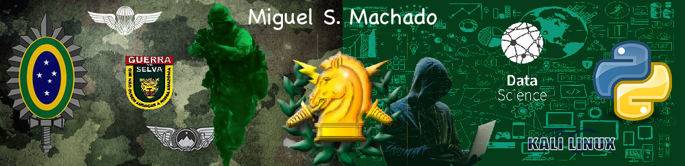

  

# Miguel S. Machado
*Militar* do Exército Brasileiro e *Cientista de Dados*

Comecei minha carreira na área de tecnologia em 2002 quando iniciei  o curso de Técnico em Eletrônica na, então, Escola Técnica Estadual de São Paulo (ETESP). Após a conclusão do curso trabalhei durante 3 anos e meio na empresa White Instrumentos de Medição e Controle Ltda., construindo e manutenindo aparelhos para detecção e aferição de gases.
No ano de 2007, ingressei na Escola Preparatória de Cadetes do Exército (EsPCEx). No período de 2008 a 2011 cursei a Academia Militar das Agulhas Negras (AMAN) e lá me formei bacharel em ciências militares e oficial da arma de Infantaria.
Com o passar dos anos na carreira, comecei a perceber a importância de tecnologia como uma forte aliada ao combate, e busquei por conta própria especializações. Dentre elas se destacam, programação em Python, Data Science, Machine Learning e Pentest.
Sem sombra de dúvidas, em um futuro breve, todos os campos de trabalho estarão necessitando de profissionais mais capacitados para lidar com máquinas e dados, tanto na análise, como na automação ou na segurança. E com essa aposta, continuarei buscando diariamente atualizações.

"Inteligência artificial, Deep Learning, Machine Learning - não importa o que você estiver fazendo, se não entender isso - **aprenda**. Porque senão, você se tornará um dinossauro em 3 anos." *Marck Kuban*

**Background in:** Eletrônica, Python, Data Science, Machine Learning, Pentesting e Oficial do Exército Brasileiro.

**Links:**
* [LinkedIn](https://www.linkedin.com/in/miguel-s-machado/)
* [Medium](https://medium.com/@miguelsmachado)

## Projetos:
* **Análise dos dados do AirBnb em Los Angeles:** https://bit.ly/3eQOcLc
* **Análise de Mídias Sociais (Twitter):** https://bit.ly/3dy0AQ1
* **Previsões sobre o preço de imóveis:** https://bit.ly/3gYjPEB
* **Analisando a violência no Rio de Janeiro:** https://bit.ly/3f7IPrs
* **Panorama do COVID-19 no mundo e no Brasil:** https://bit.ly/37XSiPL
* **Modelo de Machine Learning para análise de fraudes em cartões de crédito:** https://bit.ly/2VikGH6
* **Notebooks do livro "Approaching (almost) any machine learning problem:** https://bit.ly/3mPWPJx

